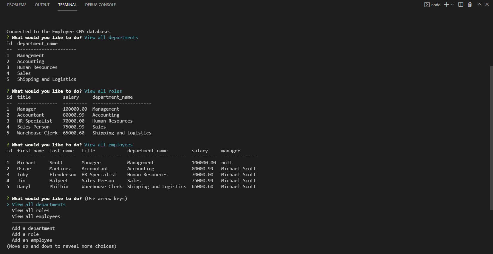

# Employee-Tracker-CMS
A command line CMS for creating/updating an employee database

  ## Table of Contents
  
  - [Description](#description)
  - [Installation](#installation)
  - [Usage](#usage)
  - [Questions](#questions)

  ---

  ## Description

  This application is a CLI built for managing and manipulating an employee database. Users are able to see all of the employees, roles and departments through command line prompt. Users are also able to add employees, roles and departments as well as update the role of a specific employee.  

  ---

  ## Installation

  Installation is easy but require a few steps:
  - Clone the repo to your machine
  - Set up the database and schema by running the command `source db/schema.sql`
  - Seed the database by running the command `source db/seeds.sql`
  - Invoke the application by running the command `npm start` in the root folder

  ---

  ## Usage

  This can be used to quickly create, manipulate and display contents of an employee management database  
  The application includes prompts for:  

  - Viewing all Employees
  - Viewing all Departments
  - Viewing all Roles
  - Adding a Department
  - Adding a Role
  - Adding an Employee
  - Updating an Employee's role 

  
   
  [Walk-Through Video](https://watch.screencastify.com/v/3DuQ7Yi1NCpevl8vzP1j)
  ---

  ## Questions
  Have any questions? Feel free to check out my github or send me an Email!

  github.com/jacobmabob  
  thejacobmccarthy@gmail.com

